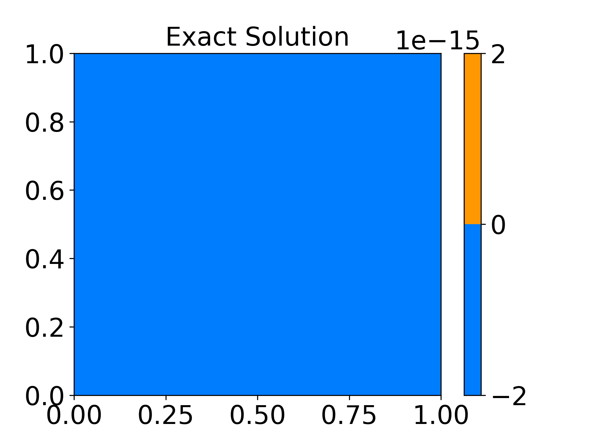
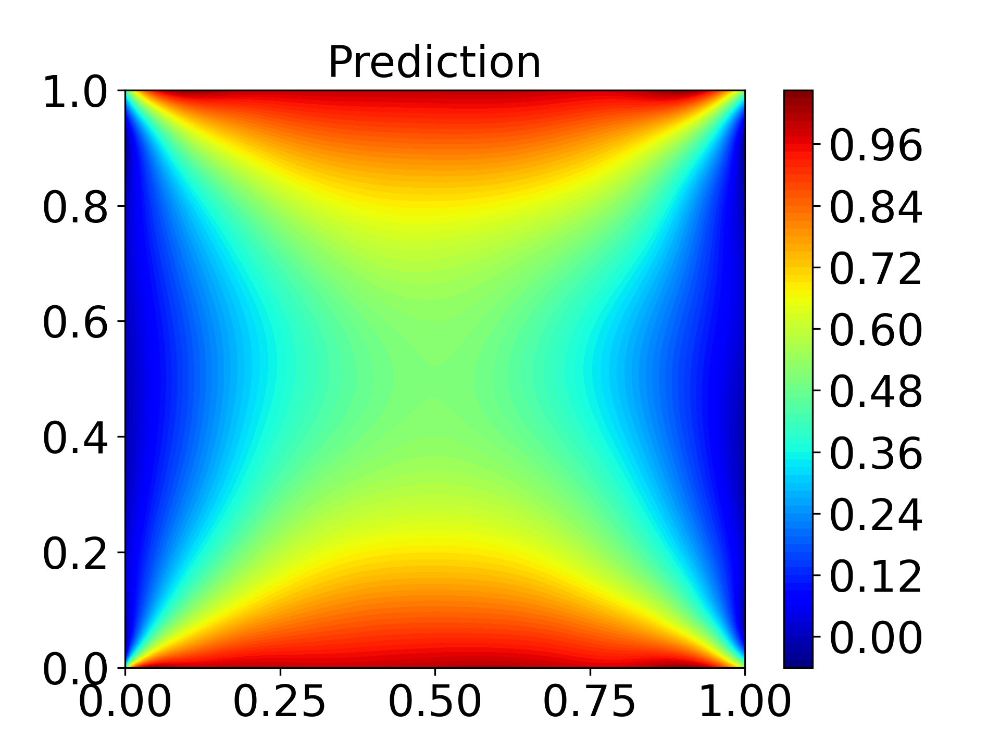

Output of the VPINNS and PINNS

<!-- #region -->
## Solution_Output of VPINNS

<div style="display: flex; justify-content: space-around;">
    <figure>
        
        <figcaption style="text-align: center;">Exact Solution_VPINNS</figcaption>
    </figure>
    <figure>
        
        <figcaption style="text-align: center;">Predicted Solution_VPINNS</figcaption>
    </figure>
    <figure>
        
        <figcaption style="text-align: center;">Error_VPINNS</figcaption>
    </figure>
</div>


---

##  Solution_Output of PINNS

<div style="display: flex; justify-content: space-around;">
    <figure>
        
        <figcaption style="text-align: center;">Exact Solution_PINN</figcaption>
    </figure>
    <figure>
        
        <figcaption style="text-align: center;">Predicted Solution_PINN</figcaption>
    </figure>
    <figure>
        
        <figcaption style="text-align: center;">Error_PINN</figcaption>
    </figure>
</div>

<!-- #endregion -->

```python

```
